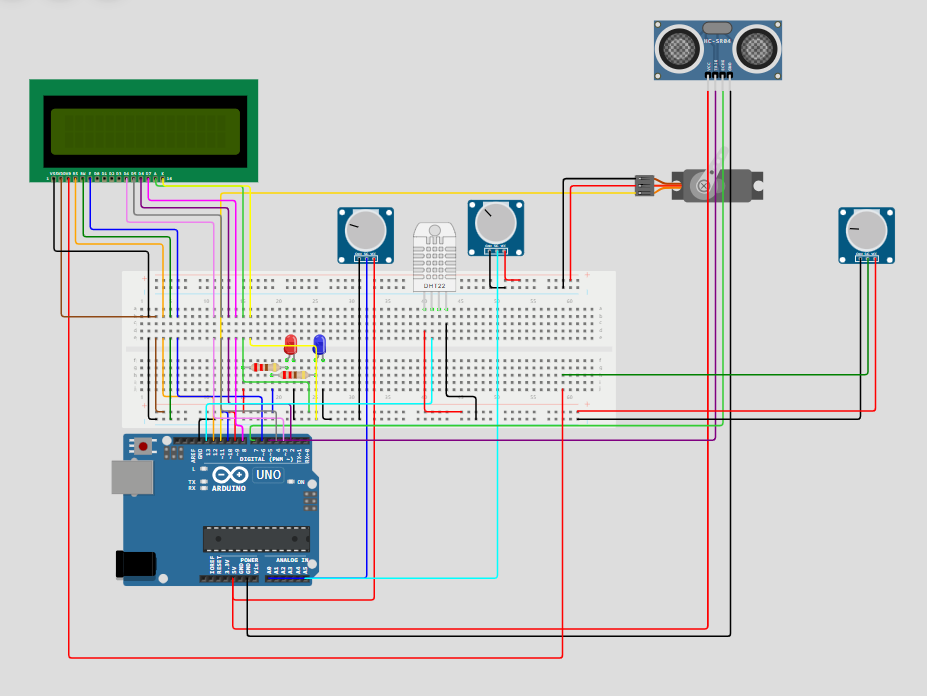
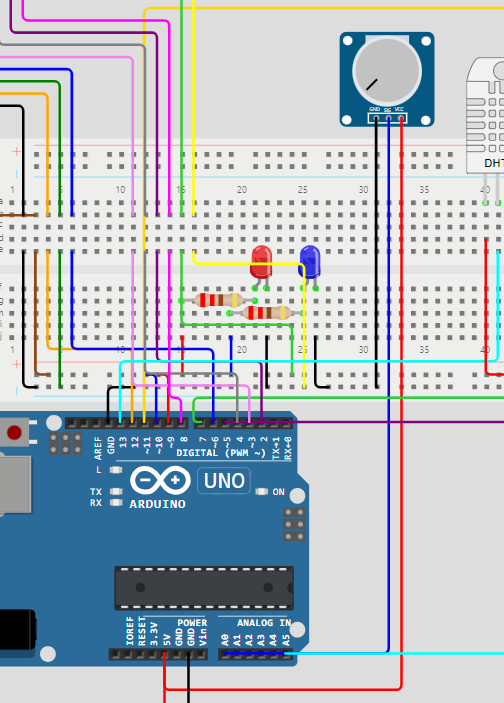

# Arduino Landing Gear Detection Tool
## Wowki Link for interactive circuit
[Landing Gear Detection Tool](https://wokwi.com/projects/413728703279373313)
## The Circuit 
### Equipment
- 1x Arduino UNO
- 1x Full Breadboard
- 3x Potentiometers 
- 1x DHT 11 Sensor
- 1x 16x2 LCD Display
- 1x Servo 
- 1x Proximity Sensor 
- 2x 220 $\Omega$ Resistors
- 1x Blue LED
- 1x Red LED
- $\approx 20$ Wires (Various M-M, F-F and M-F)
### Overall View

### LED Setup

### Proximity Sensor Setup 

### Servo Setup

### Temperature and Humidity Sensor Setup

### LCD Screen Setup

